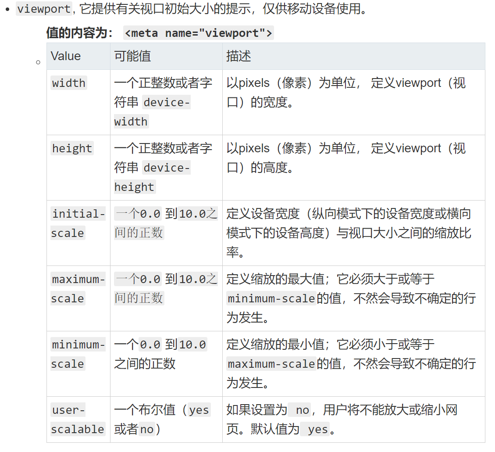

# HTML(Hyper Text Markup Language: 超文本标记语言) 语义化

[如何理解 Web 语义化？](https://www.zhihu.com/question/20455165)

所谓 web 语义化，从广义上来说，不仅要使机器（搜索引擎等）易于理解，也要使人易于理解。在团队协作开发中，对人的易于理解显得尤为重要了，一个莫名其妙的 class 会让后续的开发或者维护者一头雾水，增加了协作成本。

- 知乎 一丝

让他人在没有注释，文档的情况下快速了解作者的意图

- 知乎 疯魔慕薇

举例子: 
HTML 语义化就是使用正确的标签（总结）段落就写 p 标签，标题就写 h1 标签，文章就写article标签，视频就写video标签，等等。


# meta viewport 是做什么用的，怎么写

[MDN Meta](https://developer.mozilla.org/zh-CN/docs/Web/HTML/Element/meta)

[GitHub Head](https://github.com/joshbuchea/HEAD)

```html
<meta name="viewport" content="width=device-width, initial-scale=1, maximum-scale=1, minimum-scale=1">
```


# HTML 5 标签

[MDN Html5标签列表](https://developer.mozilla.org/zh-CN/docs/Web/Guide/HTML/HTML5/HTML5_element_list)

```html
header nav main footer video audio canvas svg
```

# H5
[H5 是什么？](https://www.zhihu.com/question/30363342)

首先HTML5并不是一项技术，而是一个标准

技术合集，低成本的营销方式，或者可以说是H5是一种用在微信上的PPT。

H5指的不是HTML5，而是某种在微信等移动端看上去酷炫能被广泛转发分享的一种东西。


# CSS两种盒模型

box-sizing: content-box(default) | border-box

每个盒子有四个边界：内容边界 Content edge、内边距边界 Padding Edge、边框边界 Border Edge、外边框边界 Margin Edge。

# CSS如何垂直居中
1、
```html
<!DOCTYPE html>
<html>
<head>
  <meta charset="utf-8">
  <title>JS Bin</title>
</head>
<body>
  <div class="parent">
    <div class="child">
      居中
    </div>
  </div>
</body>
</html>
```

```css
.parent{
  height: 600px;
  border: 1px solid red;
  position: relative;
}
.child{
  border: 1px solid green;
  position: absolute;
  top: 50%;
  left: 50%;
  transform: translate(-50%,-50%);
}
```
2、
```html
<!DOCTYPE html>
<html>
<head>
  <meta charset="utf-8">
  <title>JS Bin</title>
</head>
<body>
  <div class="parent">
    <div class="child">
        居中
    </div>
  </div>
</body>
</html>
```

```css
.parent{
  height: 600px;
  border: 1px solid red;
  position: relative;
}
.child{
  border: 1px solid green;
  position: absolute;
  width: 300px;
  height: 200px;
  margin: auto;
  top: 0;
  bottom: 0;
  left: 0;
  right: 0;
}
```

3、

```html
<!DOCTYPE html>
<html>
<head>
  <meta charset="utf-8">
  <title>JS Bin</title>
</head>
<body>
  <div class="parent">
    <div class="child">
        居中
    </div>
    
  </div>
</body>
</html>
```

```css
.parent{
  height: 600px;
  border: 3px solid red;
  
  display: flex;
  justify-content: center;
  align-items: center;
}
.child{
  border: 3px solid green;
  width: 300px;
}
```


# flex

[Flex 布局语法教程](https://www.runoob.com/w3cnote/flex-grammar.html)

# BFC(块格式化上下文: Block Formatting Context，BFC)

[MDN BFC](https://developer.mozilla.org/zh-CN/docs/Web/Guide/CSS/Block_formatting_context)
1. 浮动元素（元素的 float 不是 none）
2. 绝对定位元素（元素的 position 为 absolute 或 fixed）
3. 行内块元素
4. overflow 值不为 visible 的块元素
5. 弹性元素（display为 flex 或 inline-flex元素的直接子元素）

# CSS优先级

[CSS优先级](https://developer.mozilla.org/zh-CN/docs/Web/CSS/Specificity)
1. 越具体优先级越高
2. 同样优先级写在后面的覆盖写在前面的
3. !important 优先级最高，但是要少用

# CSS清除浮动

 ```css
.clearfix:after{
    content: '';
    display: block; /*或者 table*/
    clear: both;
}
.clearfix{
    zoom: 1; /* IE 兼容*/
}
```

# JAVASCRIPT

# ES6(常用)

## 块级作用域
## 块级变量 let
## 块级常量 const
## 箭头函数
## 默认参数值
## 剩余参数
## 展开运算符
## 模板字面量
## b解构赋值
## 类
## for of
## Symbol 类型
## Set 类型
## Map类型

# Promise、Promise.all、Promise.race怎么用？

```js
function fn(){
    return new Promise((resolve, reject)=>{
    // 成功时调用 
    resolve(数据)
    // 失败时调用 
    reject(错误)
    })
}
fn().then(success, fail).then(success2, fail2)
```

```js
Promise.all([promise1, promise2]).then(success1, fail1)
```
promise1和promise2都成功才会调用success1


```js
Promise.race([promise1, promise2]).then(success1, fail1)
```
promise1和promise2只要有一个成功就会调用success1


# 函数防抖和函数节流

```js

// 节流（一段时间执行一次之后，就不执行第二次）
function throttle(fn, delay){
    let canUse = true
    return function(){
    if(canUse){
        fn.apply(this, arguments)
        canUse = false
        setTimeout(()=>canUse = true, delay)
        }
    }
}

const throttled = throttle(()=>console.log('hi'))
throttled()
throttled()

```

注意，有些地方认为节流函数不是立刻执行的，而是在冷却时间末尾执行的（相当于施法有吟唱时间），那样说也是对的。


```js
// 防抖（一段时间会等，然后带着一起做了）
function debounce(fn, delay){
    let timerId = null
    return function(){
    const context = this
    if(timerId){window.clearTimeout(timerId)}
        timerId = setTimeout(()=>{
            fn.apply(context, arguments)
            timerId = null
        },delay)
    }
}
const debounced = debounce(()=>console.log('hi'))
debounced()
debounced()
```


# AJAX

```js
var request = new XMLHttpRequest()
request.open('GET', '/a/b/c?name=ff', true);
request.onreadystatechange = function () {
  if(request.readyState === 4 && request.status === 200) {
    console.log(request.responseText);
  }};
request.send();
```

# this

[MDN this](https://developer.mozilla.org/zh-CN/docs/Web/JavaScript/Reference/Operators/this)

1. fn()
    this => window/global
2. obj.fn()
    this => obj
3. fn.call(xx)
    this => xx
4. fn.apply(xx)
    this => xx
5. fn.bind(xx)
    this => xx
6. new Fn()
    this => 新的对象
7. fn = ()=> {}
    this => 外面的 this


this的值取决于运行时函数(方法)被调用的方式


# 闭包

[JavaScript中的闭包你理解的可能是错的](https://juejin.im/post/6844904160219889678)

JavaScript 的标准中，我们发现，标准中并没有出现过 closure 这个术语，但是，我们却不难根据古典定义，在 JavaScript 中找到对应的闭包组成部分。

## 环境部分环境：
- 函数的词法环境（执行上下文的一部分）
## 控制部分
标识符列表：
- 函数中用到的未声明的变量
表达式部分：
- 函数体

至此，我们可以认为，JavaScript 中的函数完全符合闭包的定义。它的环境部分是函数词法环境部分组成，它的标识符列表是函数中用到的未声明变量，它的表达式部分就是函数体。[2]

# 立即执行函数(Immediately Invoked Function Expression)

[IIFE（立即调用函数表达式）](https://developer.mozilla.org/zh-CN/docs/Glossary/%E7%AB%8B%E5%8D%B3%E6%89%A7%E8%A1%8C%E5%87%BD%E6%95%B0%E8%A1%A8%E8%BE%BE%E5%BC%8F)


```javascript
(function () { 
    var name = "Barry";
})();

void function () { 
    var name = "Barry";
}();

```

# JSONP

1. JSONP是通过 script 标签加载数据的方式去获取数据当做 JS 代码来执行

2. 提前在页面上声明一个函数，函数名通过接口传参的方式传给后台，后台解析到函数名后在原始数据上「包裹」这个函数名，发送给前端。换句话说，JSONP 需要对应接口的后端的配合才能实现。

```javascript
function jsonp(setting){
  setting.data = setting.data || {}
  setting.key = setting.key||'callback'
  setting.callback = setting.callback||function(){} 
  setting.data[setting.key] = '__data__'

  window.__data__ = function(data){
    setting.callback (data);
  }

  var script = document.createElement('script')
  var query = []
  for(var key in setting.data){
    query.push( key + '='+ encodeURIComponent(setting.data[key]) )
  }
  script.src = setting.url + '?' + query.join('&') // http://photo.sina.cn/aj/index?page=1&cate=recommend&jsoncallback=__data__
  document.head.appendChild(script)
  document.head.removeChild(script)

  // 服务器返回 ;__data__({data: '数据'})

}

jsonp({
  url: 'http://photo.sina.cn/aj/index',
  key: 'jsoncallback',
  data: {
    page: 1,
    cate: 'recommend'
  },
  callback: function(ret){
    console.log(ret)
  }
})
```

# CORS


## 当一个资源从与该资源本身所在的服务器不同的域、协议或端口请求一个资源时，资源会发起一个跨域 HTTP 请求。

### 跨域的解决方式

CORS是一个W3C标准，全称是”跨域资源共享”（Cross-origin resource sharing）。 对于这个方式，阮一峰老师总结的文章特别好，希望深入了解的可以看一下http://www.ruanyifeng.com/blog/2016/04/cors.html。这里我就简单的说一说大体流程。

1. 对于客户端，我们还是正常使用xhr对象发送ajax请求。唯一需要注意的是，我们需要设置我们的xhr属性withCredentials为true，不然的话，cookie是带不过去的哦，设置： xhr.withCredentials = true;

2. 对于服务器端，需要在 response header中设置如下两个字段:Access-Control-Allow-Origin: http://www.yourhost.comAccess-Control-Allow-Credentials:true这样，我们就可以跨域请求接口了。


###  jsonp实现跨域

基本原理就是通过动态创建script标签,然后利用src属性进行跨域。这么说比较模糊，我们来看个例子:
```javascript
// 定义一个fun函数
function fun(fata) {
    console.log(data);
};
// 创建一个脚本，并且告诉后端回调函数名叫fun
var body = document.getElementsByTagName('body')[0];
var script = document.gerElement('script');
script.type = 'text/javasctipt';
script.src = 'demo.js?callback=fun';
body.appendChild(script);
```

返回的js脚本，直接会执行。

所以就执行了事先定义好的fun函数了，并且把数据传入了进来。fun({"name": "name"})


当然，这个只是一个原理演示，实际情况下，我们需要动态创建这个fun函数，并且在数据返回的时候销毁它。因为在实际使用的时候，我们用的各种ajax库，基本都包含了jsonp的封装，不过我们还是要知道一下原理，不然就不知道为什么jsonp不能发post请求了~

### 服务器代理

浏览器有跨域限制，但是服务器不存在跨域问题，所以可以由服务器请求所要域的资源再返回给客户端。


* 服务器代理是万能的。


### document.domain来跨子域

对于主域名相同，而子域名不同的情况，可以使用document.domain来跨域 这种方式非常适用于iframe跨域的情况，直接看例子吧 比如a页面地址为 http://a.yourhost.com b页面为 http://b.yourhost.com。 这样就可以通过分别给两个页面设置 document.domain = http://yourhost.com 来实现跨域。 之后，就可以通过 parent 或者 window[‘iframename’]等方式去拿到iframe的window对象了。

使用window.name进行跨域。

window.name跨域同样是受到同源策略限制，父框架和子框架的src必须指向统一域名。window.name的优势在于，name的值在不同的页面(或者不同的域名)，加载后仍然存在，除非你显示的更改。并且支持的长度达到2M.

```javascript
//a页面的代码
<script type="text/javascript">
   iframe = document.createElement('iframe');
   iframe.style.display = 'none';
var state = 0;

   iframe.onload = function() {
if(state === 1) {
var data = iframe.contentWindow.name;
         console.log(data);
         iframe.contentWindow.document.write('');
         iframe.contentWindow.close();
         document.body.removeChild(iframe);
     } else if(state === 0) {
         state = 1;
         iframe.contentWindow.location = 
         'http://m.zhuanzhuan.58.com:8887/b.html';
     }
   };
   document.body.appendChild(iframe);
</script>
```
```javascript
//b页面代码
<script type="text/javascript">
   window.name = "hello";
</script>
```

### location.hash跨域

location.hash方式跨域，是子框架具有修改父框架src的hash值，通过这个属性进行传递数据，且更改hash值，页面不会刷新。但是传递的数据的字节数是有限的。

```javascript
//a页面的代码
<script type="text/javascript">
   iframe = document.createElement('iframe');
   iframe.style.display = 'none';
var state = 0;

   iframe.onload = function() {
if(state === 1) {
var data = window.location.hash;
         console.log(data);
         iframe.contentWindow.document.write('');
         iframe.contentWindow.close();
         document.body.removeChild(iframe);
     } else if(state === 0) {
         state = 1;
         iframe.contentWindow.location = 
         'http://m.zhuanzhuan.58.com:8887/b.html';
     }
   };
   document.body.appendChild(iframe);
</script>
```
```javascript
//b页面代码
<script type="text/javascript">
   parent.location.hash = "world";
</script>
```


### 使用postMessage实现页面之间通信

信息传递除了客户端与服务器之前的传递，还存在以下几个问题：


页面和新开的窗口的数据交互。

多窗口之间的数据交互。

页面与所嵌套的iframe之间的信息传递。

window.postMessage是一个HTML5的api，允许两个窗口之间进行跨域发送消息。这个应该就是以后解决dom跨域通用方法了，具体可以参照MDN。

```
补充： 其实还有一些方法，比如window.name和location.hash。就很适用于iframe的跨域，不过iframe用的比较少了，所以这些方法也就有点过时了。
```


这些就是我对跨域的了解了，实际情况下，一般用cors，jsonp等常见方法就可以了。不过遇到了一些非常规情况，我们还是需要知道有更多的方法可以选择的

- [什么是JS跨域访问？- 大黄
](https://www.zhihu.com/question/26376773/answer/244453931)


# async/await


